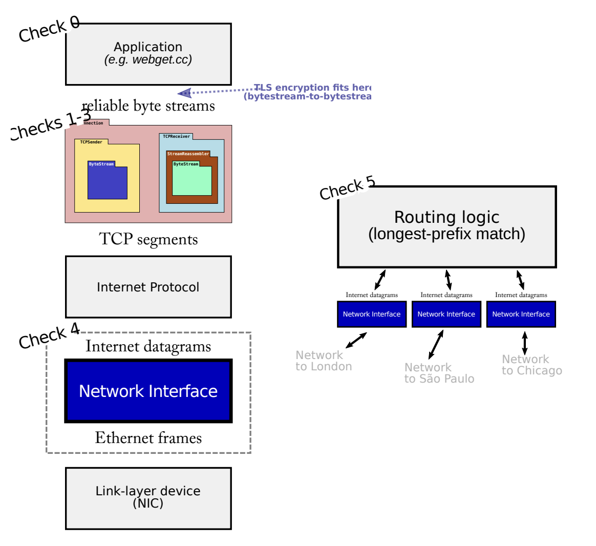
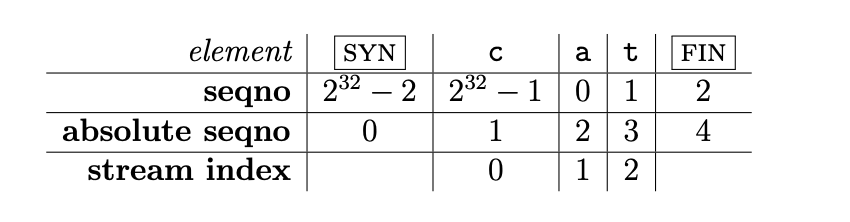

## 前言

cs144是斯坦福大学的计算机网络入门课程，在2024.4.6-4.15我陆续完成了该Lab的除了书面报告外的内容，在此总结整个过程，同时作分享交流使用。

该Lab使用现代C++，使用Cmake作为管理工具。主要的内容有：简单的网络工具的使用，在框架代码的基础上实现1. 简化的tcp协议栈（lab0-lab4），2. ARP请求与回应过程（lab5），3. 路由中最长前缀匹配的逻辑（lab6），总体而言难度不大，全程单线程，不大需要前置知识，对C++及数据结构有一定了解即可。

个人觉得做这个lab最大的收获是看框架代码的组织形式，观察课程导师Keith Winstein是怎样设计各个类的公共接口和行为，怎样方便地组织测试过程。得到了很多设计上的补益。
接下来我会介绍我是怎样实现各个lab的，具体的代码可以查看我fork的仓库，**如果有希望自己做的同学朋友还请不要看**。这里附上一张lab文档中的介绍图。



## 环境配置

如果你使用的是滚动发行版或者最新的ubuntu23.10，默认安装的gcc版本就是13.2了。
如果你使用debian12，希望使用新的gcc，请查看gcc的安装文档，编译安装gcc。相关的资料很多，这里只介绍我遇到的一些小问题：

1. vscode调试时，不能使用native debugger插件，我尝试为之设置LD_LIBRARY_PATH的环境变量（通过json配置和.gdbinit文件），始终无法正确加载symbol，故弃用。临时的解决办法是用Microsoft的cpp插件，它在启动时会新建shell，将环境变量设置在.bashrc中即可。
2. tidy target无法正常构建，默认clang版本太低，升级即可。

## LAB0 ByteStream

### 任务

1. 使用telnet工具发起http请求和其他请求。
2. 在webget.cc中使用TCPSocket发起简单的http请求。注意结束时需要向流中输入额外的空行，http中换行符为/r/n。
3. 实现可靠的字节流。

### 解决方法

在ByteStream类中添加string作为buffer即可。需要记录push和pop的字节数量。
注意流写入端关闭并且输出完毕后读端才finish。效率一般，测试框架给出的速度是1.5Gbit/s。

### 印象

框架代码使用reader和writer类来对ByteStream类进行功能扩展，同时使ByteStream可以得到两类的实例，将读取和写入功能分离。

## LAB1 Reassember

### 任务

在ByteStream的基础上实现一个流重组器，即将乱序接受到的带索引的字节段转换为有序的字节流。

### 解决方法

一开始的想法比较简单，因为它的capability（总的传输字串长度）是有限的，我们只需要维护一个从（已经输出的有序字节流的最后下标+1）开始的字符串，每次接受前重设string大小，根据接受到的段直接覆盖对应的空字符，输出时pop第一个空字符前的子串即可。**但是这样存在问题，输入的字串中也会包含空字符**。最后弃用。

更加有效率的方法是使用map存储多个段并进行合并，判断map非空和首个段下标即可。
合并视图过程如下：

```
----   ----  ---- // 已有段，标号1，2，3
  ~~~~~~~~~~~~    // 将插入的段
```

前向合并后后向合并即可。需要注意的是如下情况需要排除：

```
-------------
   ~~~~~~
```

还有很多边界上的检查，以及需要根据它传入的标志来初始化结束下标，关闭时机就是output_index == end_index。

### 印象

各项测试用例相当细节，会有在写算法题的错觉。最后测试的速度为15GBit/s，还不错。

## LAB2 TCPReceiver

### 任务

1. 实现一个循环32位正整数，将64位正整数封装，可以根据零点和检查点输出。
2. 实现一个简化后的TCPReceiver，利用Warp32来封装随机选取的开始点。

### 解决方案

1. Warp32包装时取模，去包装时根据checkpoint得到UINT32MAX的系数，左右移动下就可以得到最靠近的数值（极值点只有一个）。不需要枚举和二分来找这个系数（是的我犯蠢了）。
2. receiver的要注意的细节是，ackno和流中字节段下标有SYN和FIN两个东西，需要加加减减。选好zeropoint即可（我使用SYN前为零点）。



### 印象

一开始对Warp的理解有些问题，废了不少无谓的力气。将这个随机的起始下标封装起来，上层使用起来确实方便不少。

## LAB3 TCPSender

### 任务

实现TCPSender，可以与receive完成发送和接受字节流的任务。
它需要暂时存放已发送但未确认的message。

### 解决方案

1. 封装了timer来进行tick函数的计时，记录RTO重传超时时间，double RTO，reset。
2. 记录已发送和已确认的abs seqno（见上表）。
3. 在push过程，
    1. 假装windows size（receiver可以接受的段的长度）始终大于1。这样在windows size等于零时不断询问receiver，同时也包括了初始化时的逻辑。
    2. 建立空的msg（seqno为已发送下一位），判断是否需要SYN标志。
    3. 根据msg，windows size，input流中缓存的字串长度，msg buffer中字串长度和最大负载长度来得到负载字符串的长度。
    4. 根据输入流是否finish（payload拿走字串后），是否有足够的windows size，sender是否已经关闭（不能重复生成关闭信息）来判断是否设置FIN。
    5. 计算msg length，拒绝空msg。
    6. 发送并加入msg buffer（更新已发送seqno）。
    7. 更新唤醒计时器和重传次数。
4. 在receive过程，
    1. 更新windows size和RST
    2. 根据ackno是否包含值来判断是否需要重新初始化。
    3. 根据ackno更新已确认seqno，并且逐出buffer中的无用msg
    4. 如果缓存长度为零则关闭计时器，否则重启计时器（当次传输未完成）
5. 在tick过程，计时器更新时间，特化发送空msg的情况，不断重发buffer首包。
6. 初始化中，sender发送SYN->接受ackno->正常发送。
7. 关闭过程，sender发送FIN->接受未包含FIN的ackno->超时继续发送FIN->接受包含FIN的ackno->停止。

### 印象

比较长并且复杂，修改了好几遍逻辑。同实际上的tcp挥手相比，没有第四次和超时关闭。
需要注意的是，在lab5merge进来时添加了额外的测试用例，比如接受时是否过滤掉不在msgbuffer下标集合中的ackno，可能需要修改receive过程的细节。

## LAB4 Test CS144Socket

### 任务

更改TCPSocket为框架代码的CS144Socket，测试是否可是使用。

### 解决方案

一遍跑通了。

### 印象

框架代码的比较复杂，我片面概括下，有所缺漏，还望不吝赐教。
对于Socket，从FD到Socket到LocalStreamSocket到需要满足读写需求的类型的TCPMinnowSocket模版，用于将TCPPeer封装起来符合unix-like的sockets-api。
TCPOverIPv4OverTunFdAdapter作为其特化为CS144Socket的类型，主要是绑定到tun设备，实现ipv4数据包到tcp段的转换。
对于TCPPeer，封装了我们的sender和receiver，管理tcp connect过程，实现这个在之前也实验的一部分，不过这次没有。

## LAB5 ARP and IPv4 Datagram

### 任务

将ipv4 datagram转换为ethernet frame发送，实现ARP请求与回应。

### 解决方案

发送ipv4 datagram时将其序列化在ethernet frame中，查找是否有ip到mac地址的映射，根据ipv4地址来向实际上的ethernet address发送frame。查找不到时就需要ARP了。
ARP过程有两个超时要pop的地方，一是发送的arp请求不能在5s内再发送，二是ip到mac的映射只维护30s。
所以我维护了两张LRU链表，得益于自由的C++，可以将iterator脱离生命周期垂悬（unsafe了），用以list::iterator为值的hashmap和含有hashmap::iterator的结构体作为list成员即可以实现，当然需要小心不要访问错误的内存位置。时间更新时沿着链表删除即可。

### 印象

C++的反向迭代器删除元素时要注意位置，建议找下最佳实现。

## LAB6 Prefix Match

### 任务

实现路由过程中最长前缀匹配目标ip的转发。

### 解决方案

虽然任务书中指明O(n)的匹配时间复杂度时可以接受的，但是我们可以将pair<ip_prefix, prefix_length>作为key与rule做映射，使用hashmap需要额外定义一个hasher，可以抄下boost的hash连接函数hash_second + 0x9e3779b9 + ( hash_first << 6 ) + ( hash_first >> 2 )。
找最长前缀匹配时右移32下即可（ip转为uint32_t)，注意对0.0.0.0/0的特殊匹配。
这样时间复杂度就近似O(1)了。
注意下ipv4header的校验和。

### 印象

这个实验不需要算路由规则，很快就写完了。

## LAB7 Real World

### 任务

使用框架代码中的应用，测试自己的实现是否可以参与真实的网络连接。

1. 起一个服务端和用户端，测试是否连接成功。
2. 传输1mb的文件流，测试发送的和接受的文件sha256是否相等。

### 解决方案

直接上即可。

### 印象

发送1mb的文件大概需要1min，一开始可以很快到300kb左右，然后发送速度会下降，因为我们的tick激活时只发送buffer中第一个包，一开始的发送结束后会是一个一个包的发，加上课程的服务器连接延迟较高，不要着急。
有写完的同学朋友也可以一起跨主机测试下。

## 结语

我fork的仓库在<https://github.com/schulice/CS144-Lab。>
